# 十七、使用自编码器和 GAN 做表征学习和生成式学习

> 译者：[@SeanCheney](https://www.jianshu.com/u/130f76596b02)

自编码器是能够在无监督（即，训练集是未标记）的情况下学习输入数据的紧密表征（叫做潜在表征或编码）的人工神经网络。这些编码通常具有比输入数据低得多的维度，使得自编码器对降维有用（参见第 8 章）。自编码器还可以作为强大的特征检测器，它们可以用于无监督的深度神经网络预训练（正如我们在第 11 章中讨论过的）。最后，一些自编码器是生成式模型：他们能够随机生成与训练数据非常相似的新数据。例如，您可以在脸图片上训练自编码器，然后可以生成新脸。但是生成出来的图片通常是模糊且不够真实。

相反，用对抗生成网络（GAN）生成的人脸可以非常逼真，甚至让人认为他们是真实存在的人。你可以去这个网址[*https://thispersondoesnotexist.com/*](https://links.jianshu.com/go?to=https%3A%2F%2Fthispersondoesnotexist.com%2F)，这是用 StyleGAN 生成的人脸，自己判断一下（还可以去[*https://thisrentaldoesnotexist.com/*](https://links.jianshu.com/go?to=https%3A%2F%2Fthisrentaldoesnotexist.com%2F)，看看 GAN 生成的卧室图片），GAN 现在广泛用于超清图片涂色，图片编辑，将草图变为照片，增强数据集，生成其它类型的数据（比如文本、音频、时间序列），找出其它模型的缺点并强化，等等。

自编码器和 GAN 都是无监督的，都可以学习紧密表征，都可以用作生成模型，有许多相似的应用，但原理非常不同：

*   自编码器是通过学习，将输入复制到输出。听起来很简单，但内部结构会使其相当困难。例如，你可以限制潜在表征的大小，或者可以给输入添加噪音，训练模型恢复原始输入。这些限制组织自编码器直接将输入复制到输出，可以强迫模型学习数据的高效表征。总而言之，编码是自编码器在一些限制下学习恒等函数的副产品。

*   GAN 包括两个神经网络：一个生成器尝试生成和训练数据相似的数据，一个判别器来区分真实数据和假数据。特别之处在于，生成器和判别器在训练过程中彼此竞争：生成器就像一个制造伪钞的罪犯，而判别器就像警察一样，要把真钱挑出来。对抗训练（训练竞争神经网络），被认为是近几年的一大进展。在 2016 年，Yann LeCun 甚至说 GAN 是过去 10 年机器学习领域最有趣的发明。

本章中，我们先探究自编码器的工作原理开始，如何做降维、特征提取、无监督预训练将、如何用作生成式模型。然后过渡到 GAN。先用 GAN 生成假图片，可以看到训练很困难。会讨论对抗训练的主要难点，以及一些解决方法。先从自编码器开始。

## 有效的数据表征

以下哪一个数字序列更容易记忆？

*   40, 27, 25, 36, 81, 57, 10, 73, 19, 68
*   50, 48, 46, 44, 42, 40, 38, 36, 34, 32, 30, 28, 26, 24, 22, 20, 18, 16, 14

乍一看，第一个序列似乎应该更容易，因为它要短得多。 但是，如果仔细观察第二个序列，就会发现它是从 50 到 14 的偶数。一旦你注意到这个规律，第二个序列比第一个更容易记忆，因为你只需要记住规律就成，开始的数字和结尾的数字。请注意，如果您可以快速轻松地记住非常长的序列，则不会在意第二个序列中存在的规律。 只要记住每一个数字，就够了。 事实上，很难记住长序列，因此识别规律非常有用，并且希望能够澄清为什么在训练过程中限制自编码器会促使它发现并利用数据中的规律。

记忆、感知和模式匹配之间的关系在 20 世纪 70 年代早期由 William Chase 和 Herbert Simon 研究。 他们观察到，专业棋手能够通过观看棋盘 5 秒钟就能记住所有棋子的位置，这是大多数人认为不可能完成的任务。 然而，只有当这些棋子被放置在现实位置（来自实际比赛）时才是这种情况，而不是随机放置棋子。 国际象棋专业棋手没有比你更好的记忆，他们只是更容易看到国际象棋的规律，这要归功于他们的比赛经验。 观察规律有助于他们有效地存储信息。

就像这个记忆实验中的象棋棋手一样，一个自编码器会查看输入信息，将它们转换为高效的潜在表征，然后输出一些（希望）看起来非常接近输入的东西。 自编码器总是由两部分组成：将输入转换为潜在表征的编码器（或识别网络），然后是将潜在表征转换为输出的解码器（或生成网络）（见图 17-1）。

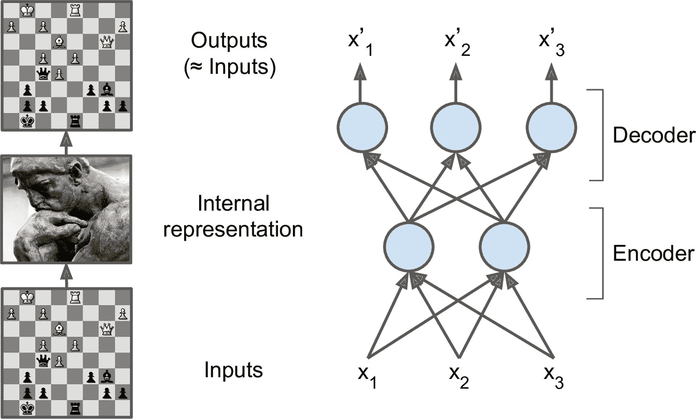图 17-1 记忆象棋试验（左）和一个简单的自编码器（右）

如你所见，自编码器通常具有与多层感知器（MLP，请参阅第 10 章）相同的体系结构，但输出层中的神经元数量必须等于输入数量。 在这个例子中，只有一个由两个神经元（编码器）组成的隐藏层和一个由三个神经元（解码器）组成的输出层。由于自编码器试图重构输入，所以输出通常被称为重建，并且损失函数包含重建损失，当重建与输入不同时，重建损失会对模型进行惩罚。

由于内部表征具有比输入数据更低的维度（它是 2D 而不是 3D），所以自编码器被认为是不完整的。 不完整的自编码器不能简单地将其输入复制到编码，但它必须找到一种方法来输出其输入的副本。 它被迫学习输入数据中最重要的特征（并删除不重要的特征）。

我们来看看如何实现一个非常简单的不完整的自编码器，以降低维度。

## 用不完整的线性自编码器来做 PCA

如果自编码器仅使用线性激活并且损失函数是均方误差（MSE），最终其实是做了主成分分析（参见第 8 章）。

以下代码创建了一个简单的线性自编码器，以在 3D 数据集上执行 PCA，并将其投影到 2D：

```py
from tensorflow import keras

encoder = keras.models.Sequential([keras.layers.Dense(2, input_shape=[3])])
decoder = keras.models.Sequential([keras.layers.Dense(3, input_shape=[2])])
autoencoder = keras.models.Sequential([encoder, decoder])

autoencoder.compile(loss="mse", optimizer=keras.optimizers.SGD(lr=0.1)) 
```

这段代码与我们在前面章节中创建的所有 MLP 没有什么大不同。只有以下几点要注意：

*   自编码器由两部分组成：编码器和解码器。两者都是常规的`Sequential`模型，每个含有一个紧密层，自编码器是一个编码器和解码器连起来的`Sequential`模型（模型可以用作其它模型中的层）。

*   自编码器的输出等于输入。

*   简单 PCA 不需要激活函数（即，所有神经元是线性的），且损失函数是 MSE。后面会看到更复杂的自编码器。

现在用生成出来的 3D 数据集训练模型，并用模型编码数据集（即将其投影到 2D）：

```py
history = autoencoder.fit(X_train, X_train, epochs=20)
codings = encoder.predict(X_train) 
```

注意，`X_train`既用来做输入，也用来做目标。图 17-2 显示了原始 3D 数据集（左侧）和自编码器隐藏层的输出（即编码层，右侧）。 可以看到，自编码器找到了投影数据的最佳二维平面，保留了数据的尽可能多的差异（就像 PCA 一样）。

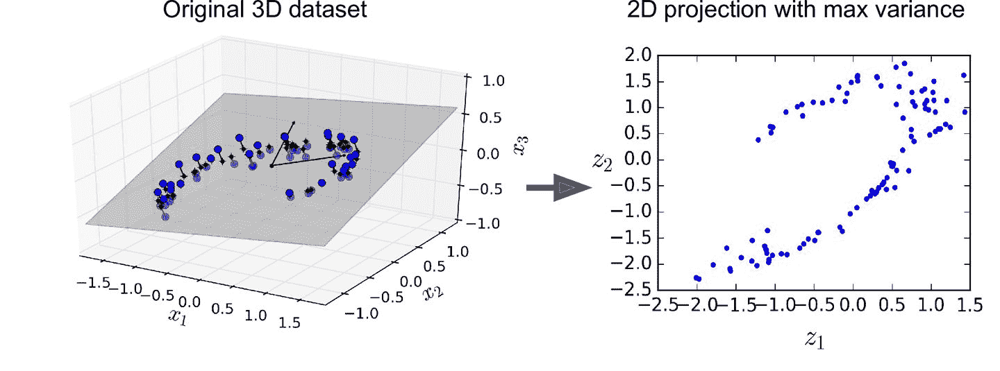图 17-2 用不完整的线性自编码器实现 PCA

> 笔记：可以将自编码器当做某种形式的自监督学习（带有自动生成标签功能的监督学习，这个例子中标签等于输入）

## 栈式自编码器

就像我们讨论过的其他神经网络一样，自编码器可以有多个隐藏层。 在这种情况下，它们被称为栈式自编码器（或深度自编码器）。 添加更多层有助于自编码器了解更复杂的编码。 但是，必须注意不要让自编码器功能太强大。 设想一个编码器非常强大，只需学习将每个输入映射到一个任意数字（并且解码器学习反向映射）即可。 很明显，这样的自编码器将完美地重构训练数据，但它不会在过程中学习到任何有用的数据表征（并且它不可能很好地泛化到新的实例）。

栈式自编码器的架构以中央隐藏层（编码层）为中心通常是对称的。 简单来说，它看起来像一个三明治。 例如，一个用于 MNIST 的自编码器（在第 3 章中介绍）可能有 784 个输入，其次是一个隐藏层，有 100 个神经元，然后是一个中央隐藏层，有 30 个神经元，然后是另一个隐藏层，有 100 个神经元，输出层有 784 个神经元。 这个栈式自编码器如图 17-3 所示。

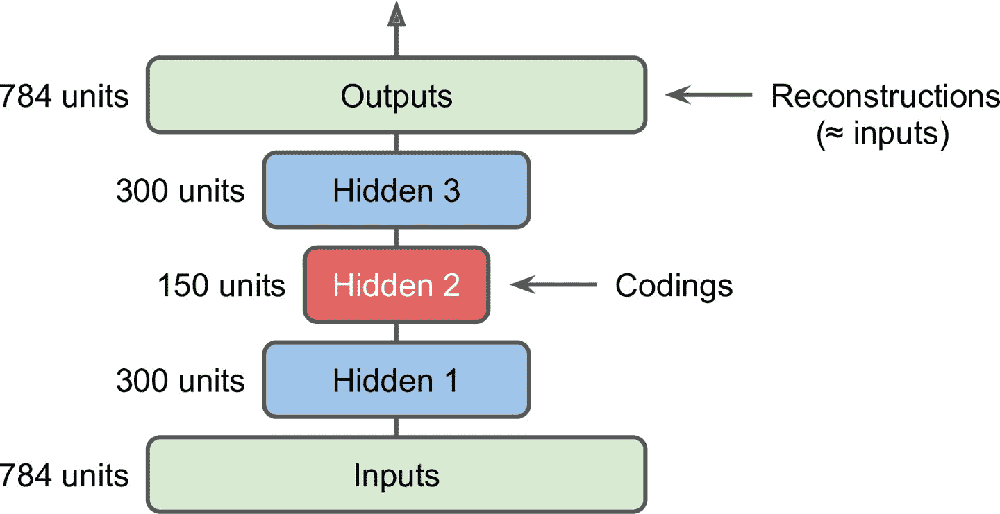图 17-3 栈式自编码器

### 用 Keras 实现栈式自编码器

你可以像常规深度 MLP 一样实现栈式自编码器。 特别是，我们在第 11 章中用于训练深度网络的技术也可以应用。例如，下面的代码使用 SELU 激活函数为 Fashion MNIST 创建了一个栈式自编码器：

```py
stacked_encoder = keras.models.Sequential([
    keras.layers.Flatten(input_shape=[28, 28]),
    keras.layers.Dense(100, activation="selu"),
    keras.layers.Dense(30, activation="selu"),
])
stacked_decoder = keras.models.Sequential([
    keras.layers.Dense(100, activation="selu", input_shape=[30]),
    keras.layers.Dense(28 * 28, activation="sigmoid"),
    keras.layers.Reshape([28, 28])
])
stacked_ae = keras.models.Sequential([stacked_encoder, stacked_decoder])
stacked_ae.compile(loss="binary_crossentropy",
                   optimizer=keras.optimizers.SGD(lr=1.5))
history = stacked_ae.fit(X_train, X_train, epochs=10,
                         validation_data=[X_valid, X_valid]) 
```

逐行看下这个代码：

*   和之前一样，自编码器包括两个子模块：编码器和解码器。

*   编码器接收 28 × 28 像素的灰度图片，打平为大小等于 784 的矢量，用两个紧密层来处理，两个紧密层都是用 SELU 激活函数（还可以加上 LeCun 归一初始化，但因为网络不深，效果不大）。对于每张输入图片，编码器输出的矢量大小是 30。

*   解码器接收大小等于 30 的编码（编码器的输出），用两个紧密层来处理，最后的矢量转换为 28 × 28 的数组，使解码器的输出和编码器的输入形状相同。

*   编译时，使用二元交叉熵损失，而不是 MSE。将重建任务当做多标签分类问题：每个像素强度表示像素应该为黑色的概率。这么界定问题（而不是当做回归问题），可以使模型收敛更快。

*   最后，使用`X_train`既作为输入，也作为目标，来训练模型（相似的，使用`X_valid`既作为验证的输入也作为目标）。

### 可视化重建

确保自编码器训练得当的方式之一，是比较输入和输出：差异不应过大。画一些验证集的图片，及其重建：

```py
def plot_image(image):
    plt.imshow(image, cmap="binary")
    plt.axis("off")

def show_reconstructions(model, n_images=5):
    reconstructions = model.predict(X_valid[:n_images])
    fig = plt.figure(figsize=(n_images * 1.5, 3))
    for image_index in range(n_images):
        plt.subplot(2, n_images, 1 + image_index)
        plot_image(X_valid[image_index])
        plt.subplot(2, n_images, 1 + n_images + image_index)
        plot_image(reconstructions[image_index])

show_reconstructions(stacked_ae) 
```

图 17-4 展示了比较结果。

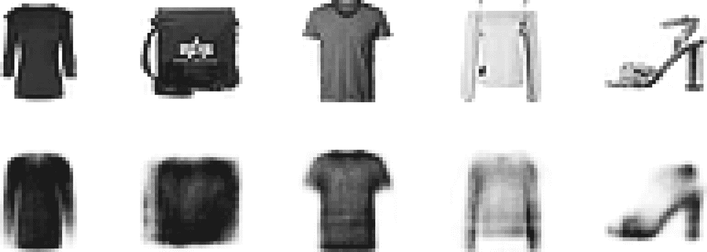图 17-4 原始图片（上）及其重建（下）

可以认出重建，但图片有些失真。需要再训练模型一段时间，或使编码器和解码器更深，或使编码更大。但如果使网络太强大，就学不到数据中的规律。

### 可视化 Fashion MNIST 数据集

训练好栈式自编码器之后，就可以用它给数据集降维了。可视化的话，结果不像（第 8 章其它介绍的）其它降维方法那么好，但自编码器的优势是可以处理带有多个实例多个特征的大数据集。所以一个策略是利用自编码器将数据集降维到一个合理的水平，然后使用另外一个降维算法做可视化。用这个策略来可视化 Fashion MNIST。首先，使用栈式自编码器的编码器将维度降到 30，然后使用 Scikit-Learn 的 t-SNE 算法实现，将维度降到 2 并做可视化：

```py
from sklearn.manifold import TSNE

X_valid_compressed = stacked_encoder.predict(X_valid)
tsne = TSNE()
X_valid_2D = tsne.fit_transform(X_valid_compressed) 
```

对数据集作图：

```py
plt.scatter(X_valid_2D[:, 0], X_valid_2D[:, 1], c=y_valid, s=10, cmap="tab10") 
```

图 17-5 展示了结果的散点图（并展示了一些图片）。t-SNE 算法区分除了几类，比较符合图片的类别（每个类的颜色不一样）。

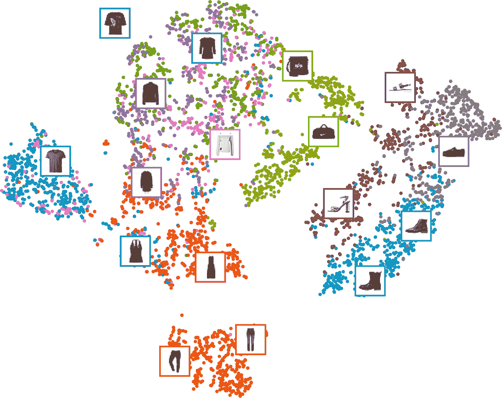图 17-5 使用自编码器和 t-SNE 对 Fashion MNIST 做可视化

自编码器的另一个用途是无监督预训练。

### 使用栈式自编码器做无监督预训练

第 11 章讨论过，如果要处理一个复杂的监督任务，但又缺少标签数据，解决的方法之一，是找一个做相似任务的神经网络，复用它的底层。这么做就可以使用少量训练数据训练出高性能的模型，因为模型不必学习所有低层次特征；模型可以复用之前的特征探测器。

相似的，如果有一个大数据集，但大部分实例是无标签的，可以用全部数据训练一个栈式自编码器，然后使用其底层创建一个神经网络，再用有标签数据来训练。例如，图 17-6 展示了如何使用栈式自编码器来做分类的无监督预训练。当训练分类器时，如果标签数据不足，可以冻住预训练层（底层）。

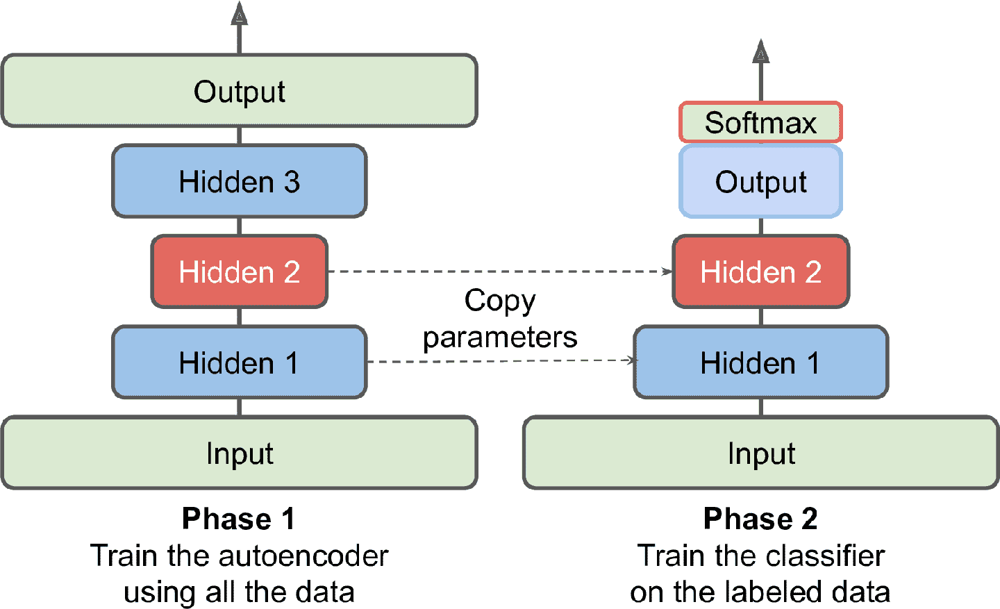图 17-6 使用自编码器做无监督预训练

> 笔记：无标签数据很多，有标签数据数据很少，非常普遍。搭建一个大无便签数据集很便宜（比如，一段小脚本可以从网上下载许多图片），但是给这些图片打标签（比如，将其标签为可爱或不可爱）只有人做才靠谱。打标签又耗时又耗钱，所以人工标注实例有几千就不错了。

代码实现没有特殊之处：用所有训练数据训练自编码器，然后用编码器层创建新的神经网络（本章有练习题例子）。

接下来，看看关联权重的方法。

### 关联权重

当自编码器整齐地对称时，就像我们刚刚构建的那样，一种常用方法是将解码器层的权重与编码器层的权重相关联。 这样减半了模型中的权重数量，加快了训练速度，并限制了过度拟合的风险。具体来说，如果自编码器总共具有`N`个层（不算输入层），并且 W<sub>L</sub> 表示第 L<sup>th</sup>层的连接权重（例如，层 1 是第一隐藏层，则层`N / 2`是编码层，而层`N`是输出层），则解码器层权重可以简单地定义为：W<sub>N–L+1</sub> = W<sub>L</sub><sup>T</sup>（其中 L = 1, 2, ..., N/2）。

使用 Keras 将层的权重关联起来，先定义一个自定义层：

```py
class DenseTranspose(keras.layers.Layer):
    def __init__(self, dense, activation=None, **kwargs):
        self.dense = dense
        self.activation = keras.activations.get(activation)
        super().__init__(**kwargs)
    def build(self, batch_input_shape):
        self.biases = self.add_weight(name="bias", initializer="zeros",
                                      shape=[self.dense.input_shape[-1]])
        super().build(batch_input_shape)
    def call(self, inputs):
        z = tf.matmul(inputs, self.dense.weights[0], transpose_b=True)
        return self.activation(z + self.biases) 
```

自定义层的作用就像一个常规紧密层，但使用了另一个紧密层的权重，并且做了转置（设置`transpose_b=True`等同于转置第二个参数，但在`matmul()`运算中实时做转置更为高效）。但是，要使用自己的偏置矢量。然后，创建一个新的栈式自编码器，将解码器的紧密层和编码器的紧密层关联起来：

```py
dense_1 = keras.layers.Dense(100, activation="selu")
dense_2 = keras.layers.Dense(30, activation="selu")

tied_encoder = keras.models.Sequential([
    keras.layers.Flatten(input_shape=[28, 28]),
    dense_1,
    dense_2
])

tied_decoder = keras.models.Sequential([
    DenseTranspose(dense_2, activation="selu"),
    DenseTranspose(dense_1, activation="sigmoid"),
    keras.layers.Reshape([28, 28])
])

tied_ae = keras.models.Sequential([tied_encoder, tied_decoder]) 
```

这个模型的重建误差小于前一个模型，且参数量只有一半。

### 一次训练一个自编码器

不是一次完成整个栈式自编码器的训练，而是一次训练一个浅自编码器，然后将所有这些自编码器堆叠到一个栈式自编码器（因此名称）中，通常要快得多，如图 17-7 所示。 这个方法如今用的不多了，但偶尔还会撞见谈到“贪婪层级训练”的论文，所以还是看一看。

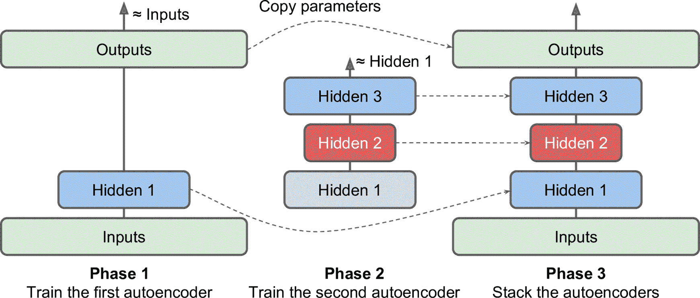图 17-7 一次训练一个自编码器

在训练的第一阶段，第一个自编码器学习重构输入。 然后，使用整个训练集训练第一个自编码器，得到一个新的（压缩过的）训练集。然后用这个数据集训练第二个自编码器。这是第二阶段的训练。最后，我们用所有这些自编码器创建一个三明治结构，见图 17-7（即，先把每个自编码器的隐藏层叠起来，再加上输出层）。这样就得到了最终的栈式自编码器（见 notebook）。我们可以用这种方式训练更多的自编码器，搭建非常深的栈式自编码器。

正如前面讨论过的，现在的一大趋势是 Geoffrey Hinton 等人在 2006 年发现的，靠这种贪婪层级方法，可以用无监督方式训练神经网络。他们还使用了受限玻尔兹曼机（RBM，见附录 E）。但在 2007 年，Yoshua Bengio 发现只用自编码器也可以达到不错的效果。在这几年间，自编码器是唯一的有效训练深度网络的方法，知道出现第 11 章介绍过的方法。

自编码器不限于紧密网络：还有卷积自编码器和循环自编码器。

## 卷积自编码器

如果处理的是图片，则前面介绍的自编码器的效果可能一般（除非图片非常小）。第 14 章介绍过，对于图片任务，卷积神经网络比紧密网络的效果更好。所以如果想用自编码器来处理图片的话（例如，无监督预训练或降维），你需要搭建一个卷积自编码器。编码器是一个包含卷积层和池化层的常规 CNN。通常降低输入的空间维度（即，高和宽），同时增加深度（即，特征映射的数量）。解码器的工作相反（放大图片，压缩深度），要这么做的话，可以转置卷积层（或者，可以将上采样层和卷积层合并）。下面是一个卷积自编码器处理 Fashion MNIST 的例子：

```py
conv_encoder = keras.models.Sequential([
    keras.layers.Reshape([28, 28, 1], input_shape=[28, 28]),
    keras.layers.Conv2D(16, kernel_size=3, padding="same", activation="selu"),
    keras.layers.MaxPool2D(pool_size=2),
    keras.layers.Conv2D(32, kernel_size=3, padding="same", activation="selu"),
    keras.layers.MaxPool2D(pool_size=2),
    keras.layers.Conv2D(64, kernel_size=3, padding="same", activation="selu"),
    keras.layers.MaxPool2D(pool_size=2)
])
conv_decoder = keras.models.Sequential([
    keras.layers.Conv2DTranspose(32, kernel_size=3, strides=2, padding="valid",
                                 activation="selu",
                                 input_shape=[3, 3, 64]),
    keras.layers.Conv2DTranspose(16, kernel_size=3, strides=2, padding="same",
                                 activation="selu"),
    keras.layers.Conv2DTranspose(1, kernel_size=3, strides=2, padding="same",
                                 activation="sigmoid"),
    keras.layers.Reshape([28, 28])
])
conv_ae = keras.models.Sequential([conv_encoder, conv_decoder]) 
```

## 循环自编码器

如果你想用自编码器处理序列，比如对时间序列或文本无监督学习和降维，则循环神经网络要优于紧密网络。搭建循环自编码器很简单：编码器是一个序列到矢量的 RNN，而解码器是矢量到序列的 RNN：

```py
recurrent_encoder = keras.models.Sequential([
    keras.layers.LSTM(100, return_sequences=True, input_shape=[None, 28]),
    keras.layers.LSTM(30)
])
recurrent_decoder = keras.models.Sequential([
    keras.layers.RepeatVector(28, input_shape=[30]),
    keras.layers.LSTM(100, return_sequences=True),
    keras.layers.TimeDistributed(keras.layers.Dense(28, activation="sigmoid"))
])
recurrent_ae = keras.models.Sequential([recurrent_encoder, recurrent_decoder]) 
```

这个循环自编码器可以处理任意长度的序列，每个时间步有 28 个维度。这意味着，可以将 Fashion MNIST 的图片作为几行序列来处理。注意，解码器第一层用的是`RepeatVector`，以保证在每个时间步将输入矢量传给解码器。

我们现在已经看过了多种自编码器（基本的、栈式的、卷积的、循环的），学习了训练的方法（一次性训练或逐层训练）。还学习了两种应用：视觉可视化和无监督学习。

为了让自编码学习特征，我们限制了编码层的大小（使它处于不完整的状态）。还可以使用许多其他的限制方法，可以让编码层和输入层一样大，甚至更大，得到一个过完成的自编码器。下面就是其中一些方法。

## 降噪自编码

另一种强制自编码器学习特征的方法是为其输入添加噪声，对其进行训练以恢复原始的无噪声输入。 自 20 世纪 80 年代以来，使用自编码器消除噪音的想法已经出现（例如，在 Yann LeCun 的 1987 年硕士论文中提到过）。 在 2008 年的一篇论文中，帕斯卡尔文森特等人。 表明自编码器也可用于特征提取。 在 2010 年的一篇炉温中， Vincent 等人引入了栈式降噪自编码器。

噪声可以是添加到输入的纯高斯噪声，或者可以随机关闭输入，就像 dropout（在第 11 章介绍）。 图 17-8 显示了这两种方法。

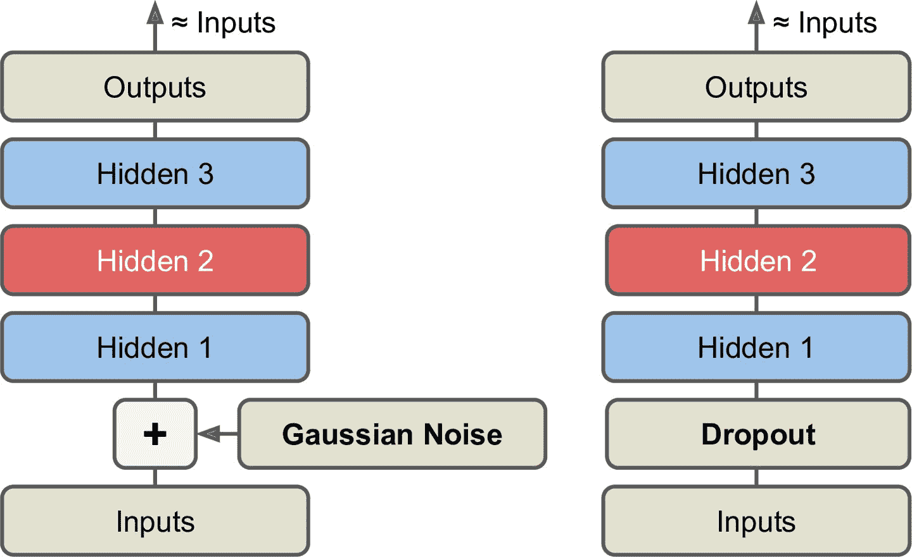图 17-8 高斯噪音（左）和 dropout（右）的降噪自编码器

实现很简单：常规的栈式自编码器中有一个应用于输入的`Dropout`层（或使用`GaussianNoise`层）。`Dropout`层只在训练中起作用（`GaussianNoise`层也只在训练中起作用）：

```py
dropout_encoder = keras.models.Sequential([
    keras.layers.Flatten(input_shape=[28, 28]),
    keras.layers.Dropout(0.5),
    keras.layers.Dense(100, activation="selu"),
    keras.layers.Dense(30, activation="selu")
])
dropout_decoder = keras.models.Sequential([
    keras.layers.Dense(100, activation="selu", input_shape=[30]),
    keras.layers.Dense(28 * 28, activation="sigmoid"),
    keras.layers.Reshape([28, 28])
])
dropout_ae = keras.models.Sequential([dropout_encoder, dropout_decoder]) 
```

图 17-9 展示了一些带有造影的图片（有一半像素被丢弃），重建图片是用基于 dropout 的自编码器实现的。注意自编码器是如何猜测图片中不存在的细节的，比如四张图片的领口。

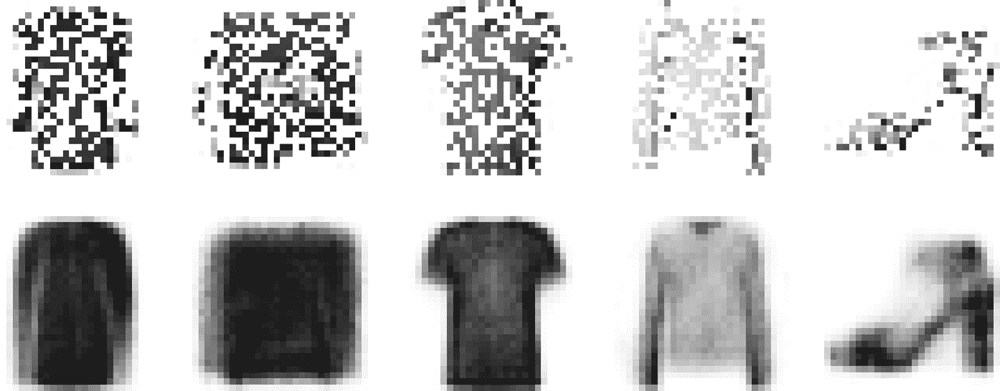图 17-9 噪音图片（上）和重建图片（下）

## 稀疏自编码器

通常良好特征提取的另一种约束是稀疏性：通过向损失函数添加适当的项，让自编码器减少编码层中活动神经元的数量。 例如，可以让编码层中平均只有 5% 的活跃神经元。 这迫使自编码器将每个输入表示为少量激活的组合。 因此，编码层中的每个神经元通常都会代表一个有用的特征（如果每个月只能说几个字，你会说的特别精炼）。

使用 sigmoid 激活函数可以实现这个目的。添加一个编码层（比如，有 300 个神经元），给编码层的激活函数添加ℓ<sub>1</sub>正则（解码器就是一个常规解码器）：

```py
sparse_l1_encoder = keras.models.Sequential([
    keras.layers.Flatten(input_shape=[28, 28]),
    keras.layers.Dense(100, activation="selu"),
    keras.layers.Dense(300, activation="sigmoid"),
    keras.layers.ActivityRegularization(l1=1e-3)
])
sparse_l1_decoder = keras.models.Sequential([
    keras.layers.Dense(100, activation="selu", input_shape=[300]),
    keras.layers.Dense(28 * 28, activation="sigmoid"),
    keras.layers.Reshape([28, 28])
])
sparse_l1_ae = keras.models.Sequential([sparse_l1_encoder, sparse_l1_decoder]) 
```

`ActivityRegularization`只是返回输入，但副作用是新增了训练损失，大小等于输入的绝对值之和（这个层只在训练中起作用）。等价的，可以移出`ActivityRegularization`，并在前一层设置`activity_regularizer=keras.regularizers.l1(1e-3)`。这项惩罚可以让神经网络产生接近 0 的编码，如果没有正确重建输入，还是会有损失，仍然会产生一些非 0 值。不使用ℓ<sub>2</sub>，而使用ℓ<sub>1</sub>，可以让神经网络保存最重要的编码，同时消除输入图片不需要的编码（而不是压缩所有编码）。

另一种结果更好的方法是在每次训练迭代中测量编码层的实际稀疏度，当偏移目标值，就惩罚模型。 我们通过计算整个训练批次中编码层中每个神经元的平均激活来实现。 批量大小不能太小，否则平均数不准确。

一旦我们对每个神经元进行平均激活，我们希望通过向损失函数添加稀疏损失来惩罚太活跃的神经元，或不够活跃的神经元。 例如，如果我们测量一个神经元的平均激活值为 0.3，但目标稀疏度为 0.1，那么它必须受到惩罚才能激活更少。 一种方法可以简单地将平方误差`(0.3-0.1)^2`添加到损失函数中，但实际上更好的方法是使用 Kullback-Leibler 散度（在第 4 章中简要讨论），它具有比均方误差更强的梯度，如图 17-10 所示。

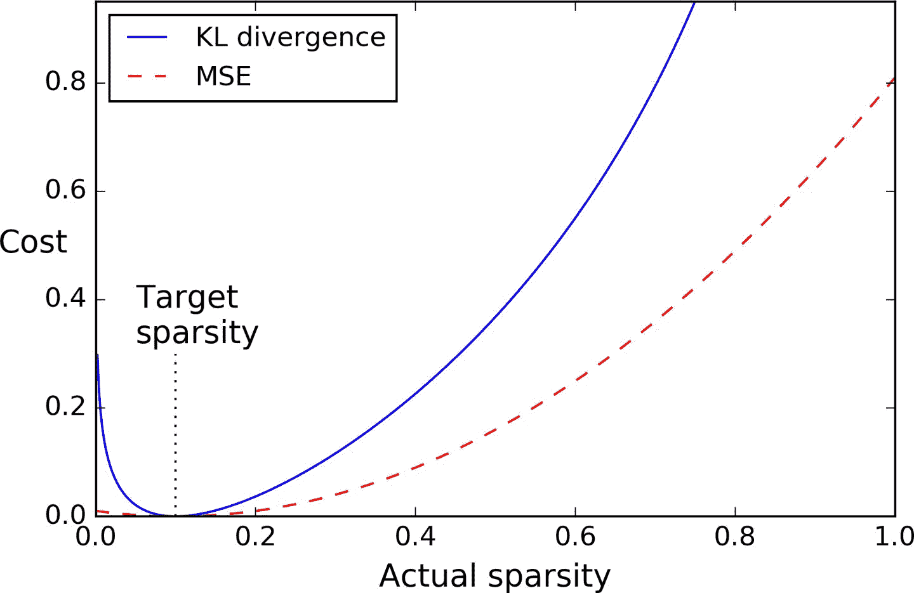图 17-10 稀疏损失

给定两个离散的概率分布`P`和`Q`，这些分布之间的 KL 散度，记为 D<sub>KL</sub>(P // Q)，可以使用公式 17-1 计算。

公式 17-1 Kullback–Leibler 散度

在我们的例子中，我们想要测量编码层中的神经元将激活的目标概率`p`与实际概率`q`（即，训练批次上的平均激活）之间的差异。 所以 KL 散度简化为公式 17-2。

公式 17-2 目标稀疏度 p 和实际稀疏度 q 之间的 KL 散度

一旦我们已经计算了编码层中每个神经元的稀疏损失，就相加这些损失，并将结果添加到损失函数中。 为了控制稀疏损失和重构损失的相对重要性，我们可以用稀疏权重超参数乘以稀疏损失。 如果这个权重太高，模型会紧贴目标稀疏度，但它可能无法正确重建输入，导致模型无用。 相反，如果它太低，模型将大多忽略稀疏目标，它不会学习任何有趣的功能。

现在就可以实现基于 KL 散度的稀疏自编码器了。首先，创建一个自定义正则器来实现 KL 散度正则：

```py
K = keras.backend
kl_divergence = keras.losses.kullback_leibler_divergence

class KLDivergenceRegularizer(keras.regularizers.Regularizer):
    def __init__(self, weight, target=0.1):
        self.weight = weight
        self.target = target
    def __call__(self, inputs):
        mean_activities = K.mean(inputs, axis=0)
        return self.weight * (
            kl_divergence(self.target, mean_activities) +
            kl_divergence(1\. - self.target, 1\. - mean_activities)) 
```

使用`KLDivergenceRegularizer`作为编码层的激活函数，创建稀疏自编码器：

```py
kld_reg = KLDivergenceRegularizer(weight=0.05, target=0.1)
sparse_kl_encoder = keras.models.Sequential([
    keras.layers.Flatten(input_shape=[28, 28]),
    keras.layers.Dense(100, activation="selu"),
    keras.layers.Dense(300, activation="sigmoid", activity_regularizer=kld_reg)
])
sparse_kl_decoder = keras.models.Sequential([
    keras.layers.Dense(100, activation="selu", input_shape=[300]),
    keras.layers.Dense(28 * 28, activation="sigmoid"),
    keras.layers.Reshape([28, 28])
])
sparse_kl_ae = keras.models.Sequential([sparse_kl_encoder, sparse_kl_decoder]) 
```

在 Fashion MNIST 上训练好稀疏自编码器之后，编码层中的神经元的激活大部分接近 0（70%的激活小于 0.1），所有神经元的平均值在 0.1 附近（90%的平均激活在 0.1 和 0.2 之间）见图 17-11。

图 17-11 编码层的所有激活的分布（左）和每个神经元平均激活的分布（右）

## 变分自编码器（VAE）

Diederik Kingma 和 Max Welling 于 2013 年推出了另一类重要的自编码器，并迅速成为最受欢迎的自编码器类型之一：变分自编码器。

它与我们迄今为止讨论的所有自编码器非常不同，特别是：

*   它们是概率自编码器，意味着即使在训练之后，它们的输出部分也是偶然确定的（相对于仅在训练过程中使用随机性的自编码器的去噪）。

*   最重要的是，它们是生成自编码器，这意味着它们可以生成看起来像从训练集中采样的新实例。

这两个属性使它们与 RBM 非常相似（见附录 E），但它们更容易训练，并且取样过程更快（在 RBM 之前，您需要等待网络稳定在“热平衡”之后才能进行取样一个新的实例）。正如其名字，变分自编码器要做变分贝叶斯推断（第 9 章介绍过），这是估计变微分推断的一种有效方式。

我们来看看他们是如何工作的。 图 17-12（左）显示了一个变分自编码器。 当然，您可以认识到所有自编码器的基本结构，编码器后跟解码器（在本例中，它们都有两个隐藏层），但有一个转折点：不是直接为给定的输入生成编码 ，编码器产生平均编码`μ`和标准差`σ`。 然后从平均值`μ`和标准差`σ`的高斯分布随机采样实际编码。 之后，解码器正常解码采样的编码。 该图的右侧部分显示了一个训练实例通过此自编码器。 首先，编码器产生`μ`和`σ`，随后对编码进行随机采样（注意它不是完全位于`μ`处），最后对编码进行解码，最终的输出与训练实例类似。

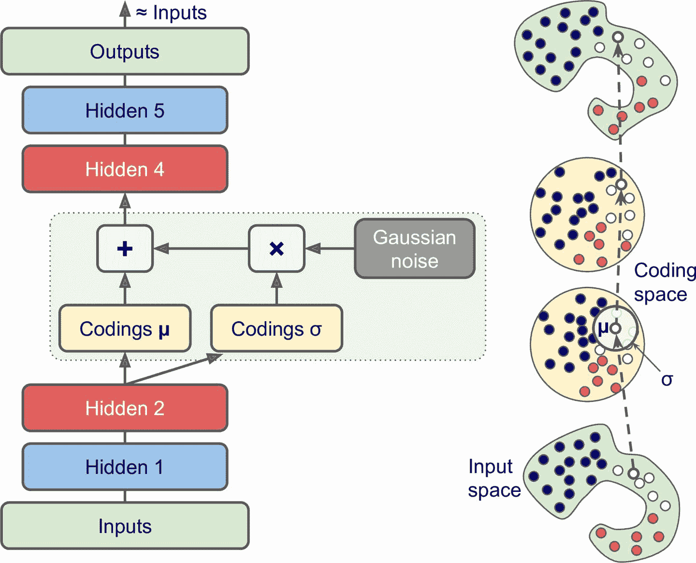图 17-12 变分自编码器（左）和一个执行中的实例（右）

从图中可以看出，尽管输入可能具有非常复杂的分布，但变分自编码器倾向于产生编码，看起来好像它们是从简单的高斯分布采样的：在训练期间，损失函数（将在下面讨论）推动 编码在编码空间（也称为潜在空间）内逐渐迁移以占据看起来像高斯点集成的云的大致（超）球形区域。 一个重要的结果是，在训练了一个变分自编码器之后，你可以很容易地生成一个新的实例：只需从高斯分布中抽取一个随机编码，对它进行解码就可以了！

再来看看损失函数。 它由两部分组成。 首先是通常的重建损失，推动自编码器重现其输入（我们可以使用交叉熵来解决这个问题，如前所述）。 第二种是潜在的损失，推动自编码器使编码看起来像是从简单的高斯分布中采样，为此我们使用目标分布（高斯分布）与编码实际分布之间的 KL 散度。 数学比以前复杂一点，特别是因为高斯噪声，它限制了可以传输到编码层的信息量（从而推动自编码器学习有用的特征）。 幸好，这些方程经过简化，可以用公式 17-3 计算潜在损失：

公式 17-3 变分自编码器的潜在损失

在这个公式中，L 是潜在损失，n 是编码维度，μ<sub>i</sub> 和 σ<sub>i</sub>是编码的第 i<sup>th</sup>个成分的平均值和标准差。矢量 u 和σ是编码器的输出，见图 17-12 的左边。

一种常见的变体是训练编码器输出`γ= log(σ^2)`而不是`σ`。 可以用公式 17-4 计算潜在损失。这个方法的计算更稳定，且可以加速训练。

公式 17-4 变分自编码器的潜在损失，使用γ= log(σ^2)

给 Fashion MNIST 创建一个自编码器（见图 17-12，使用γ变体）。首先，需要一个自定义层从编码采样，给定μ 和 γ：

```py
class Sampling(keras.layers.Layer):
    def call(self, inputs):
        mean, log_var = inputs
        return K.random_normal(tf.shape(log_var)) * K.exp(log_var / 2) + mean 
```

这个`Sampling`层接收两个输入：`mean (μ)` 和 `log_var (γ)`。使用函数`K.random_normal()`根据正态分布随机采样矢量（形状为γ）平均值为 0 标准差为 1。然后乘以 exp(γ / 2)（这个值等于σ），最后加上μ并返回结果。这样就能从平均值为 0 标准差为 1 的正态分布采样编码矢量。

然后，创建编码器，因为模型不是完全顺序的，所以要使用 Functional API：

```py
codings_size = 10

inputs = keras.layers.Input(shape=[28, 28])
z = keras.layers.Flatten()(inputs)
z = keras.layers.Dense(150, activation="selu")(z)
z = keras.layers.Dense(100, activation="selu")(z)
codings_mean = keras.layers.Dense(codings_size)(z)  # μ
codings_log_var = keras.layers.Dense(codings_size)(z)  # γ
codings = Sampling()([codings_mean, codings_log_var])
variational_encoder = keras.Model(
    inputs=[inputs], outputs=[codings_mean, codings_log_var, codings]) 
```

注意，输出`codings_mean` (μ)和`codings_log_var` (γ)的`Dense`层，有同样的输入（即，第二个紧密层的输出）。然后将`codings_mean`和`codings_log_var`传给`Sampling`层。最后，`variational_encoder`模型有三个输出，可以用来检查`codings_mean`和`codings_log_var`的值。真正使用的是最后一个（`codings`）。下面创建解码器：

```py
decoder_inputs = keras.layers.Input(shape=[codings_size])
x = keras.layers.Dense(100, activation="selu")(decoder_inputs)
x = keras.layers.Dense(150, activation="selu")(x)
x = keras.layers.Dense(28 * 28, activation="sigmoid")(x)
outputs = keras.layers.Reshape([28, 28])(x)
variational_decoder = keras.Model(inputs=[decoder_inputs], outputs=[outputs]) 
```

对于解码器，因为是简单栈式结构，可以不使用 Functional API，而使用 Sequential API。最后，创建变分自编码器：

```py
_, _, codings = variational_encoder(inputs)
reconstructions = variational_decoder(codings)
variational_ae = keras.Model(inputs=[inputs], outputs=[reconstructions]) 
```

注意，我们忽略了编码器的前两个输出。最后，必须将潜在损失和重建损失加起来：

```py
latent_loss = -0.5 * K.sum(
    1 + codings_log_var - K.exp(codings_log_var) - K.square(codings_mean),
    axis=-1)
variational_ae.add_loss(K.mean(latent_loss) / 784.)
variational_ae.compile(loss="binary_crossentropy", optimizer="rmsprop") 
```

我们首先用公式 17-4 计算批次中每个实例的潜在损失。然后计算所有实例的平均损失，然后除以，使其量纲与重建损失一致。实际上，变分自编码器的重建损失是像素重建误差的和，但当 Keras 计算`"binary_crossentropy"`损失时，它计算的是 784 个像素的平均值，而不是和。因此，重建损失比真正要的值小 784 倍。我们可以定义一个自定义损失来计算误差和，但除以 784 更简单。

注意，这里使用了`RMSprop`优化器。最后，我们可以训练自编码器。

```py
history = variational_ae.fit(X_train, X_train, epochs=50, batch_size=128,
                             validation_data=[X_valid, X_valid]) 
```

### 生成 Fashion MNIST 图片

接下来用上面的变分自编码器生成图片。我们要做的只是从高斯分布随机采样编码，然后做解码：

```py
codings = tf.random.normal(shape=[12, codings_size])
images = variational_decoder(codings).numpy() 
```

图 17-13 展示了 12 张生成的图片。

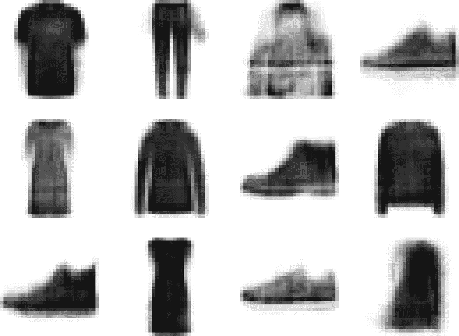图 17-13 用变分自编码器生成的 Fashion MNIST 图片

大多数生成的图片很逼真，就是有些模糊。其它的效果一般，这是因为自编码器只学习了几分钟。经过微调和更长时间的训练，效果就能编号。

变分自编码器也可以做语义插值：不是对两张图片做像素级插值（结果就像是两张图重叠），而是在编码级插值。先用编码层运行两张图片，然后对两个编码层插值，然后解码插值编码，得到结果图片。结果就像一个常规的 Fashion MINIST 图片，但还是介于原始图之间。在接下来的代码中，将 12 个生成出来的编码，排列成 3 × 4 的网格，然后用 TensorFlow 的`tf.image.resize()`函数，将其缩放为 5 × 7。默认条件下，`resize()`函数会做双线性插值，所以每两个行或列都会包含插值编码。然后用解码器生成所有图片：

```py
codings_grid = tf.reshape(codings, [1, 3, 4, codings_size])
larger_grid = tf.image.resize(codings_grid, size=[5, 7])
interpolated_codings = tf.reshape(larger_grid, [-1, codings_size])
images = variational_decoder(interpolated_codings).numpy() 
```

图 17-14 展示了结果。画框的是原始图，其余是根据附近图片做出的语义插值图。注意，第 4 行第 5 列的鞋，是上下两张图的完美融合。

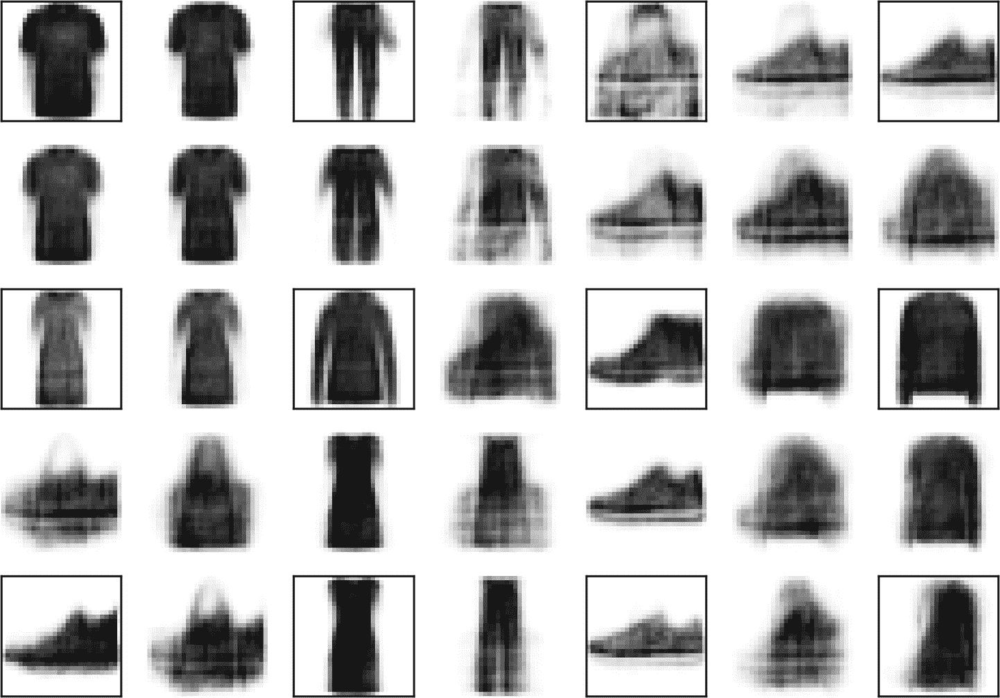图 17-14 语义插值

变分自编码器流行几年之后，就被 GAN 超越了，后者可以生成更为真实的图片。

## 对抗生成网络（GAN）

对抗生成网络是 Ian Goodfellow 在 2014 年的一篇[论文](https://links.jianshu.com/go?to=https%3A%2F%2Fhoml.info%2Fgan)中提出的，尽管一开始就引起了众人的兴趣，但用了几年时间才客服了训练 GAN 的一些难点。和其它伟大的想法一样，GAN 的本质很简单：让神经网络互相竞争，让其在竞争中进步。见图 17-15，GAN 包括两个神经网络：

*   生成器
    使用随机分布作为输入（通常为高斯分布），并输出一些数据，比如图片。可以将随机输入作为生成文件的潜在表征（即，编码）。生成器的作用和变分自编码器中的解码器差不多，可以用同样的方式生成图片（只要输入一些高斯噪音，就能输出全新的图片）。但是，生成器的训练过程很不一样。

*   判别器
    从训练集取出一张图片，判断图片是真是假。

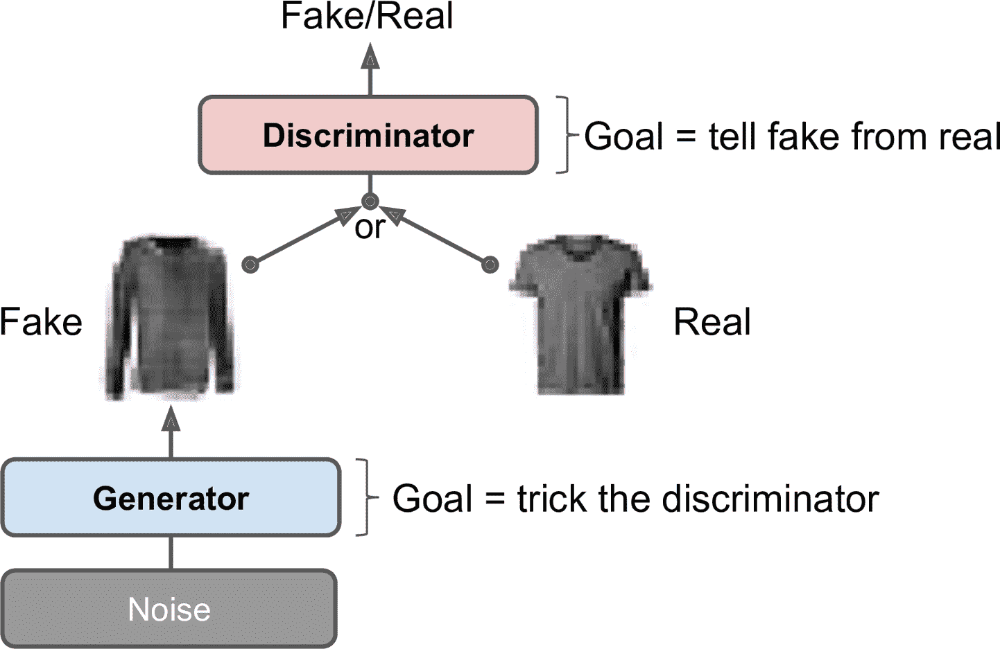图 17-15 一个对抗生成网络

在训练中，生成器和判别器的目标正好相反：判别器判断图片的真假，生成器尽力生成看起来像真图的图片。因为 GAN 由这两个目的不同的网络组成，所以不能像常规网络那样训练。每次训练迭代分成两个阶段：

*   第一个阶段，训练判别器。从训练集取样一批真实图片，数量与假图片相同。假图片的标签设为 0，真图片的标签设为 1，判别器用这个有标签的批次训练一步，使用二元交叉熵损失。反向传播在这一阶段只优化判别器的权重。

*   第二个阶段，训练生成器。首先用生成器产生另一个批次的假图片，再用判别器来判断图片是真是假。这一次不添加真图片，但所有标签都设为 1（真）：换句话说，我们想让生成器产生可以让判别器信以为真的图片。判别器的权重在这一步是冷冻的，所以反向传播只影响生成器。

> 笔记：生成器看不到真图，但却逐渐生成出逼真的不骗。它只是使用了经过判别器返回的梯度。幸好，随着判别器的优化，这些二手梯度中包含的关于真图的信息也越来越多，所以生成器才能进步。

接下来为 Fashion MNIST 创建一个简单的 GAN 模型。

首先，创建生成器和判别器。生成器很像自编码器的解码器，判别器就是一个常规的二元分类器（图片作为输入，输出是包含一个神经元的紧密层，使用 sigmoid 激活函数）。对于每次训练迭代中的第二阶段，需要完整的 GAN 模型：

```py
codings_size = 30

generator = keras.models.Sequential([
    keras.layers.Dense(100, activation="selu", input_shape=[codings_size]),
    keras.layers.Dense(150, activation="selu"),
    keras.layers.Dense(28 * 28, activation="sigmoid"),
    keras.layers.Reshape([28, 28])
])
discriminator = keras.models.Sequential([
    keras.layers.Flatten(input_shape=[28, 28]),
    keras.layers.Dense(150, activation="selu"),
    keras.layers.Dense(100, activation="selu"),
    keras.layers.Dense(1, activation="sigmoid")
])
gan = keras.models.Sequential([generator, discriminator]) 
```

然后，我们需要编译这些模型。因为判别器是一个二元分类器，我们可以使用二元交叉熵损失。生成器只能通过 GAN 训练，所以不需要编译生成器。`gan`模型也是一个二元分类器，所以可以使用二元交叉熵损失。重要的，不能在第二个阶段训练判别器，所以编译模型之前，使其不可训练：

```py
discriminator.compile(loss="binary_crossentropy", optimizer="rmsprop")
discriminator.trainable = False
gan.compile(loss="binary_crossentropy", optimizer="rmsprop") 
```

> 笔记：Keras 只有在编译模型时才会考虑`trainable`属性，所以运行这段代码后，如果调用`fit()`方法或`train_on_batch()`方法，`discriminator`就是可训练的了。但在`gan`模型上调用这些方法，判别器是不可训练的。

因为训练循环是非常规的，我们不能使用常规的`fit()`方法。但我们可以写一个自定义的训练循环。要这么做，需要先创建一个`Dataset`迭代这些图片：

```py
batch_size = 32
dataset = tf.data.Dataset.from_tensor_slices(X_train).shuffle(1000)
dataset = dataset.batch(batch_size, drop_remainder=True).prefetch(1) 
```

现在就可以来写训练循环了。用`train_gan()`函数来包装：

```py
def train_gan(gan, dataset, batch_size, codings_size, n_epochs=50):
    generator, discriminator = gan.layers
    for epoch in range(n_epochs):
        for X_batch in dataset:
            # phase 1 - training the discriminator
            noise = tf.random.normal(shape=[batch_size, codings_size])
            generated_images = generator(noise)
            X_fake_and_real = tf.concat([generated_images, X_batch], axis=0)
            y1 = tf.constant([[0.]] * batch_size + [[1.]] * batch_size)
            discriminator.trainable = True
            discriminator.train_on_batch(X_fake_and_real, y1)
            # phase 2 - training the generator
            noise = tf.random.normal(shape=[batch_size, codings_size])
            y2 = tf.constant([[1.]] * batch_size)
            discriminator.trainable = False
            gan.train_on_batch(noise, y2)

train_gan(gan, dataset, batch_size, codings_size) 
```

和前面讨论的一样，每次迭代都有两个阶段：

*   在第一阶段，向生成器输入高斯噪音来生成假图片，然后再补充同等数量的真图片。假图片的目标`y1`设为 0，真图片的目标`y1`设为 1。然后用这个批次训练判别器。注意，将判别器的`trainable`属性设为`True`：这是为了避免 Keras 检查到现在是`False`而在训练时为`True`，显示警告。

*   在第二阶段，向 GAN 输入一些高斯噪音。它的生成器会开始假图片，然后判别器会判断其真假。我们希望判别器判断图片是真的，所以`y2`设为 1。注意，为了避免警告，将`trainable`属性设为`False`。

这样就好了！如果展示生成出来的图片（见图 17-16），可以看到在第一个周期的后期，图片看起来已经接近 Fashion MNIST 的图片了。

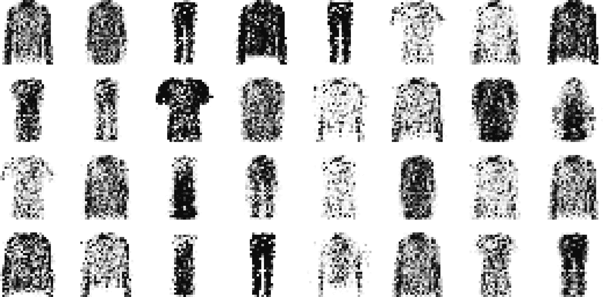图 17-16 GAN 训练一个周期后，生成的图片

不过，再怎么训练，图片的质量并没有提升，还发现在有的周期 GAN 完全忘了学到了什么。为什么会这样？貌似训练 GAN 很有挑战。接下来看看原因。

### 训练 GAN 的难点

在训练中，生成器和判别器不断试图超越对方，这是一个零和博弈。随着训练的进行，可能会达成博弈学家称为纳什均衡的状态：每个选手都不改变策略，并认为对方也不会改变策略。例如，当所有司机都靠左行驶时，就达到了纳什均衡：没有司机会选择换边。当然，也有第二种可能：每个人都靠右行驶。不同的初始状态和动力学会导致不同的均衡。在这个例子中，达到均衡时，只有一种最优策略，但纳什均衡包括多种竞争策略（比如，捕食者追逐猎物，猎物试图逃跑，两者都要改变策略）。

如何将博弈论应用到 GAN 上呢？论文作者证明，GAN 只能达到一种均衡状态：生成器产生完美的真实图片，同时让判别器来判断（50%为真，50%为假）。这是件好事：看起来只要训练 GAN 足够久，就会达到均衡，获得完美的生成器。不过，并没有这么简单：没有人能保证一定能达到均衡。

最大的困难是模式坍塌：生成器的输出逐渐变得不那么丰富。为什么会这样？假设生成器产生的鞋子图片比其它类的图片更让人信服，假鞋子图片就会更多的欺骗判别器，就会导致生成更多的鞋子图片。逐渐的，生成器会忘掉如何生成其它类的图片。同时，判别器唯一能看到的就是鞋子图片，所以判别器也会忘掉如何判断其它类的图片。最终，当判别器想要区分假鞋和真鞋时，生成器会被迫生成其它类。生成器可能变成善于衬衫，而忘了鞋子，判别器也会发生同样的转变。GAN 会逐渐在一些类上循环，从而对哪一类都不擅长。

另外，因为生成器和判别器不断试探对方，它们的参数可能不断摇摆。训练可能一开始正常，但因为不稳定性，会突然发散。又因为多种因素可能会影响动力学，GAN 会对超参数特别敏感：微调超参数会特别花费时间。

这些问题自从 2014 年就一直困扰着人们：人们发表了许多论文，一些论文提出新的损失函数、或稳定化训练的手段、或避免模式坍塌。例如，经验接力：将生成器在每个迭代产生的图片存储在接力缓存中（逐次丢弃旧的生成图），使用真实图片和从缓存中取出的图片训练判别器。这样可以降低判别器对生成器的最后一个输出过拟合的几率。另外一个方法是小批次判别：测量批次中图片的相似度，然后将数据传给判别器，判别器就可以删掉缺乏散度的假图片。这可以鼓励生成器产生更多类的图片，避免模式坍塌。

总而言之，这是一个非常活跃的研究领域，GAN 的动力学仍然没有彻底搞清。好消息是人们已经取得了一定成果，效果不俗。接下来看看一些成功的架构，从深度卷积 GAN 开始，这是几年前的前沿成果。然后再看两个新近的（更复杂的）架构。

### 深度卷积 GAN

2014 年的原始 GAN 论文是用卷积层实验的，但只用来生成小图片。不久之后，许多人使用深度卷积网络为大图片创建 GAN。过程艰难，因为训练不稳定，但最终 Alec Radford 等人试验了许多不同的架构和超参数，在 2015 年取得了成功。他们将最终架构称为深度卷积 GAN（DCGAN）。他们提出的搭建稳定卷积 GAN 的建议如下：

*   （判别器中）用卷积步长（strided convolutions）、（生成器中）用转置卷积，替换池化层。

*   生成器和判别器都使用批归一化，除了生成器的输出层和判别器的输入层。

*   去除深层架构中的全连接隐藏层。

*   生成器的输出层使用 tanh 激活，其它层使用 ReLU 激活。

*   判别器的所有层使用 leaky ReLU 激活。

这些建议在许多任务中有效，但存在例外，所以你还是需要尝试不同的超参数（事实上，改变随机种子，再训练模型，可能就成功了）。例如，下面是一个小型的 DCGAN，在 Fashion MNIST 上效果不错：

```py
codings_size = 100

generator = keras.models.Sequential([
    keras.layers.Dense(7 * 7 * 128, input_shape=[codings_size]),
    keras.layers.Reshape([7, 7, 128]),
    keras.layers.BatchNormalization(),
    keras.layers.Conv2DTranspose(64, kernel_size=5, strides=2, padding="same",
                                 activation="selu"),
    keras.layers.BatchNormalization(),
    keras.layers.Conv2DTranspose(1, kernel_size=5, strides=2, padding="same",
                                 activation="tanh")
])
discriminator = keras.models.Sequential([
    keras.layers.Conv2D(64, kernel_size=5, strides=2, padding="same",
                        activation=keras.layers.LeakyReLU(0.2),
                        input_shape=[28, 28, 1]),
    keras.layers.Dropout(0.4),
    keras.layers.Conv2D(128, kernel_size=5, strides=2, padding="same",
                        activation=keras.layers.LeakyReLU(0.2)),
    keras.layers.Dropout(0.4),
    keras.layers.Flatten(),
    keras.layers.Dense(1, activation="sigmoid")
])
gan = keras.models.Sequential([generator, discriminator]) 
```

生成器的编码大小为 100，将其投影到 6272 个维度上（7 * 7 * 128），将结果变形为 7 × 7 × 128 的张量。这个张量经过批归一化，然后输入给步长为 2 的转置卷积层，从 7 × 7 上采样为 14 × 14，深度从 128 降到 64。结果再做一次批归一化，传给另一个步长为 2 的转置卷积层，从 14 × 14 上采样为 28 × 28，深度从 64 降到 1。这个层使用 tanh 激活函数，输出范围是-1 到 1。因为这个原因，在训练 GAN 之前，需要收缩训练集到相同的范围。还需要变形，加上通道维度：

```py
X_train = X_train.reshape(-1, 28, 28, 1) * 2\. - 1\. # 变形和收缩 
```

判别器看起来很像英语二元分类的常规 CNN，除了使用的不是最大池化层降采样图片，而是使用卷积步长。另外，使用的激活函数是 leaky ReLU。

总之，我们遵守了 DCGAN 的建议，除了将判别器中的`BatchNormalization`替换成了`Dropout`层（否则训练会变得不稳定），生成器的 ReLU 替换为 SELU。你可以随意调整这个架构：可以看到对超参数（特别是学习率）的敏感度。

最后，要创建数据集，然后编译训练模型，使用和之前一样的代码。经过 50 个周期的训练，生成器的图片见图 17-17。还是不怎么完美，但一些图片已经很逼真了。

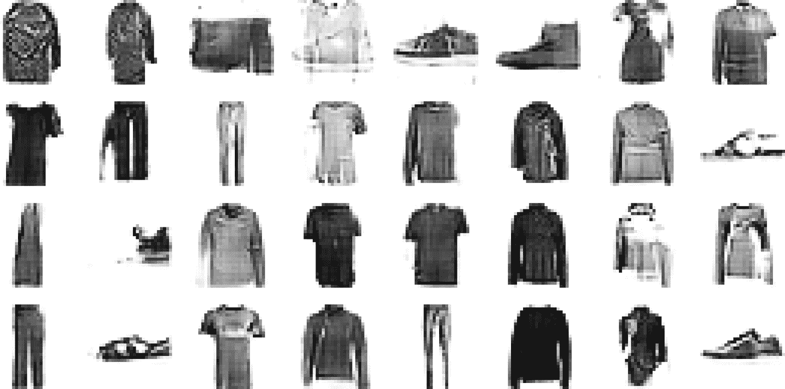图 17-17 DCGAN 经过 50 个周期的训练，生成的图片

如果扩大这个架构，然后用更大的面部数据集训练，可以得到相当逼真的图片。事实上，DCGAN 可以学习到许多有意义的潜在表征，见图 17-18：从生成的诸多图片中手动选取了九张（左上），包括三张戴眼镜的男性，三张不戴眼镜的男性，和三张不戴眼镜的女性。对于每一类，对其编码做平均，用平均的结果再生成一张图片（放在下方）。总之，下方的图片是上方图片的平均。但不是简单的像素平均，而是潜在空间的平均，所以看起来仍是正常的人脸。如果用戴眼镜的男性，减去不戴眼镜的男性，加上不戴眼镜的女性，使用平均编码，就得到了右边 3 × 3 网格的正中的图片，一个戴眼镜的女性！其它八张是添加了一些噪声的结果，用于解释 DCGAN 的语义插值能力。可以用人脸做加减法就像科幻小说一样！

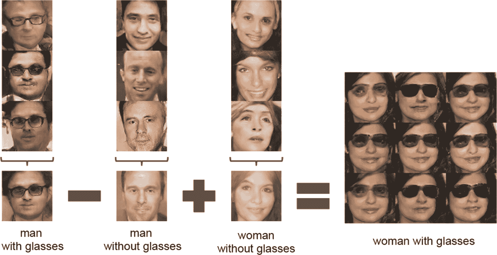图 17-18 面部的矢量运算（来自 DCGAN 论文的图 7）

> 提示：如果将图片的类作为另一个输入，输入给生成器和判别器，它们都能学到每个类的样子，你就可以控制生成器产生图片的类。这被称为条件 GAN（CGAN）。

但是，DCGAN 并不完美。比如，当你使用 DCGAN 生成非常大的图片时，通常是局部逼真，但整体不协调（比如 T 恤的一个袖子比另一个长很多）。如何处理这种问题呢？

### GAN 的渐进式变大

Nvidia 研究员 Tero Karras 等人在 2018 年发表了一篇[论文](https://links.jianshu.com/go?to=https%3A%2F%2Fhoml.info%2Fprogan)，提出了一个重要方法：他们建议在训练时，先从生成小图片开始，然后逐步给生成器和判别器添加卷积层，生成越来越大的图片（4 × 4, 8 × 8, 16 × 16, …, 512 × 512, 1,024 × 1,024）。这个方法和栈式自编码器的贪婪层级训练很像。余下的层添加到生成器的末端和判别器的前端，之前训练好的层仍然可训练。

例如，当生成器的输出从 4 × 4 变为 8 × 8 时（见图 17-19），在现有的卷积层上加上一个上采样层（使用近邻过滤），使其输出 8 × 8 的特征映射。再接着传给一个新的卷积层（使用 same 填充，步长为 1，输出为 8 × 8）。接着是一个新的输出卷积层：这是一个常规卷积层，核大小为 1，将输出投影到定好的颜色通道上（比如 3）。为了避免破坏第一个训练好的卷积层的权重，最后的输出是原始输出层（现在的输出是 8 × 8 的特征映射）的权重之和。新输出的权重是α，原始输出的权重是 1-α，α逐渐从 0 变为 1。换句话说，新的卷积层（图 17-19 中的虚线）是淡入的，而原始输出层淡出。向判别器（跟着平均池化层做降采样）添加新卷积层时，也是用相似的淡入淡出方法。

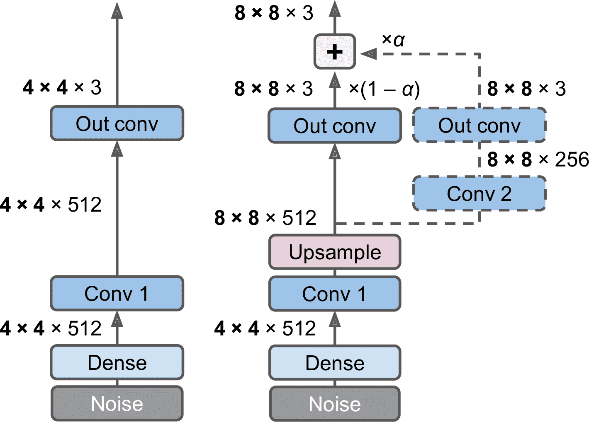图 17-19 GAN 的渐进式变大：GAN 生成器输出 4 × 4 的彩色图片（左）；将其扩展为 8 × 8 的图片（右）

这篇文章还提出了一些其它的方法，用于提高输出的散度（避免模式坍塌），使训练更稳定：

*   小批次标准差层

    添加在判别器的靠近末端的位置。对于输入的每个位置，计算批次（`S = tf.math.reduce_std(inputs, axis=[0, -1])`）中，所有通道所有实例的标准差。接着，这些标准差对所有点做平均，得到一个单值（`v = tf.reduce_​mean(S)`）。最后，给批次中的每个实例添加一个额外的特征映射，填入计算得到的单值（`tf.concat([inputs, tf.fill([batch_size, height, width, 1], v)], axis=-1)`）。这样又什么用呢？如果生成器产生的图片没有什么偏差，则判别器的特征映射的标准差会特别小。有了这个层，判别器就可以做出判断。可以让生成器产生高散度的输出，降低模式坍塌的风险。

*   相等的学习率

    使用一个简单的高斯分布（平均值为 0，标准差为 1）初始化权重，而不使用 He 初始化。但是，权重在运行时（即，每次执行层）会变小：会除以，n<sub>inputs</sub>是层的输入数。这篇论文说，使用这个方法可以显著提升 GAN 使用 RMSProp、Adam 和其它适应梯度优化器时的性能。事实上，这些优化器用估计标准差（见第 11 章）归一化了梯度更新，所以有较大动态范围的参数需要更长时间训练，而较小动态范围的参数可能更新过快，会导致不稳定。通过缩放模型的部分参数，可以保证参数的动态范围在训练过程中一致，可以用相同的速度学习。这样既加速了训练，也做到了稳定。

*   像素级归一化层

    生成器的每个卷积层之后添加。它能归一化每个激活函数，基于相同图片相同位置的所有激活，而且跨通道（除以平均激活平方的平方根）。在 TensorFlow 的代码中，这是`inputs / tf.sqrt(tf.reduce_mean(tf.square(X), axis=-1, keepdims=True) + 1e-8)`（平滑项 1e-8 用于避免零除）。这种方法可以避免生成器和判别器的过分竞争导致的激活爆炸。

使用所有这些方法，作者制作出了[非常逼真的人脸图片](https://links.jianshu.com/go?to=https%3A%2F%2Fhoml.info%2Fprogandemo)。但如何给“逼真”下定义呢？GAN 的评估时一大挑战：尽管可以自动评估生成图片的散度，判断质量要棘手和主观的多。一种方法是让人来打分，但成本高且耗时。因此作者建议比较生成图和训练图的局部图片结构，在各个层次比较。这个想法使他们创造出了另一个突破性的成果：StyleGAN。

### StyleGAN

相同的 Nvidia 团队在 2018 年的一篇[论文](https://links.jianshu.com/go?to=https%3A%2F%2Fhoml.info%2Fstylegan)中提出了高性能的高清图片生成架构，StyleGAN。作者在生成器中使用了风格迁移方法，使生成的图片和训练图片在每个层次，都有相同的局部结构，极大提升了图片的质量。判别器和损失函数没有变动，只修改了生成器。StyleGAN 包含两个网络（见图 17-20）：

*   映射网络

    一个八层的 MLP，将潜在表征`z`（即，编码）映射为矢量`w`。矢量然后传给仿射变换（即，没有激活函数的紧密层，用图 17-20 中的框 A 表示），输出许多矢量。这些矢量在不同级别控制着生成图片的风格，从细粒度纹理（比如，头发颜色）到高级特征（比如，成人或孩子）。总而言之，映射网络将编码变为许多风格矢量。

*   合成网络

    负责生成图片。它有一个固定的学好的输入（这个输入在训练之后是不变的，但在训练中被反向传播更新）。和之前一样，合成网络使用多个卷积核上采样层处理输入，但有两处不同：首先，输入和所有卷积层的输出（在激活函数之前）都添加了噪音。第二，每个噪音层的后面是一个适应实例归一化（AdaIN）层：它独立标准化每个特征映射（减去平均值，除以标准差），然后使用风格矢量确定每个特征映射的缩放和偏移（风格矢量对每个特征映射包含一个缩放和一个偏置项）。

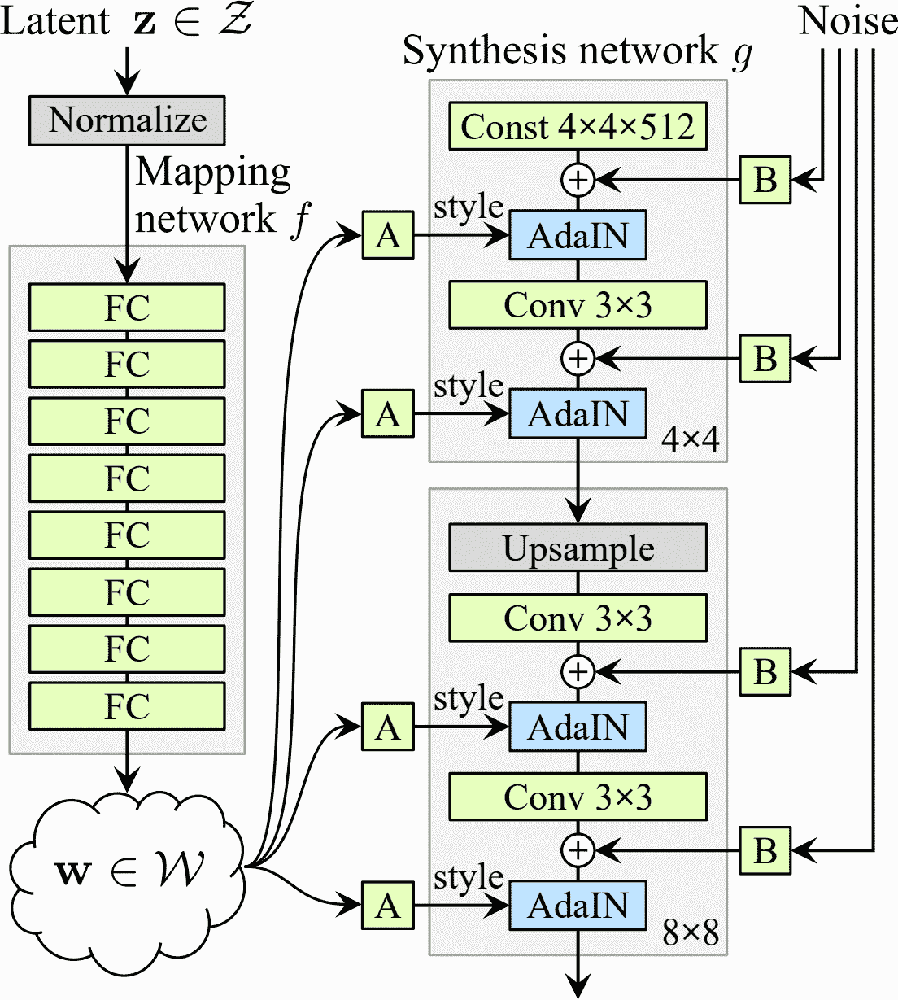图 17-20 StyleGAN 的生成器架构（StyleGAN 论文的图 1 的一部分）

在编码层独立添加噪音非常重要。图片的一些部分是很随机的，比如雀斑和头发的确切位置。在早期的 GAN 中，这个随机性要么来自编码，要么是生成器的一些伪噪音。如果来自编码，意味着生成器要用编码的很重要的一部分来存储噪音：这样会非常浪费。另外，噪音会在网络中流动，直到生成器的最后一层：这是一种没有必要的约束，会显著减慢训练。最后，因为噪音的存在，会出现一些视觉伪影。如果是生成器来制造伪噪音，噪音可能不够真实，造成更多的视觉伪影。另外，用生成器的一部分权重来生成伪噪音，这也是一种浪费。通过添加额外的噪音输入，可以避免所有这些问题；GAN 可以利用噪音，给图片的每个部分添加随机量。

添加的噪音在每个级别都不同。每个噪音输入包含一个单独的包含高斯噪音的特征映射，广播到所有特征映射上（给定级别），然后在添加前用每个特征的缩放因子缩放（这是图 17-20 的框 B）。

最后，StyleGAN 使用了一种称为混合正则（或风格混合）的方法，生成图的一定比例使用两个编码来生成。特别的，编码 c<sub>1</sub> 和 c<sub>2</sub>发送给映射网络，得到两个风格矢量 w<sub>1</sub> 和 w<sub>2</sub>。然后合成网络使用风格 w<sub>1</sub>生成第一级，用 w<sub>2</sub>生成其余的。级的选取是随机的。这可以防止模型认为临近的级是有关联的，会导致 GAN 的局部性，每个风格矢量只会影响生成图的有限数量的特性。

GAN 的种类如此之多，用一本书才能介绍全。希望这里的内容可以告诉你 GAN 的主要观点，以及继续学习的动力。如果你对数学概念掌握不好，可以看看网上的博客。然后就可以创建自己的 GAN 了，如果一开始碰到问题，千万别气馁：有问题是正常的，通常要好好练习，才能掌握好。如果对实现细节不明白，可以看看别人的 Keras 和 TensorFlow 实现。事实上，如果你只是想快速获得一些经验的结果，可以使用预训练模型（例如，存在适用于 Keras 的 StyleGAN 预训练模型）。

下一章会介绍深度学习的另一领域：深度强化学习。

## 练习

1.  自编码器主要用来做什么？

2.  假设你想训练一个分类器，有许多未打标签的训练数据，只有一千多打了标签的数据。如何使用自编码器来解决这个问题？

3.  如果自编码器完美重建了输入，它一定是个好的自编码器吗？如何评估自编码器的表现？

4.  自编码器的欠完成和过完成是什么？超欠完成的风险是什么？过完成的风险是什么？

5.  如何将栈式自编码器的权重连起来？这么做的意义是什么？

6.  什么是生成式模型？可以举出生成式自编码器的例子吗？

7.  GAN 是什么？可以用于什么任务？

8.  训练 GAN 的难点是什么？

9.  用去噪音自编码器预训练一个图片分类器。可以使用 MNIST，或是更复杂的图片数据集，比如 CIFAR10。不管用的是什么数据集，遵循下面的步骤：

    *   将数据集分成训练集和测试集。在完整训练集上，训练一个深度去噪音自编码器。

    *   检查图片正确重建了。可视化最激活编码层神经元的图片。

    *   搭建一个分类 DNN，使用自编码器的浅层。用训练集中的 500 张图片来训练。然后判断预训练是否提升了性能？

10.  用刚才选择的数据集，训练一个变分自编码器。用它来生成图片。或者，用一个没有标签的数据集，来生成新样本。

11.  训练一个 DCGAN 来处理选择的数据集，生成新图片。添加经验接力，看看它是否有作用。再将其变为一个条件 GAN，可以控制生成的类。

参考答案见附录 A。

